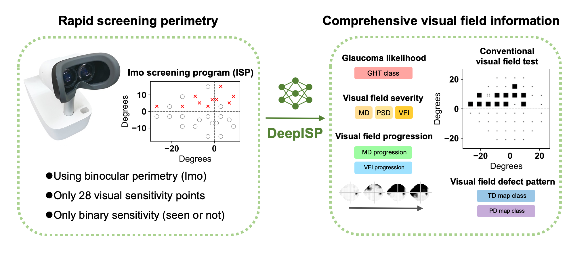

# DeepISP

Deep learning models for ISP (Imo Screening Program) to HFA (Humphrey Field Analyzer) conversion



## Overview

Deep learning models for predicting HFA parameters from ISP data:
- **ISP2HFA**: Predicts HFA visual field test results (MD, PSD, VFI, Pattern/Total Deviation Map) from ISP
- **ISP2HFAprog**: Predicts visual field progression metrics (MD slope, VFI slope, progression probability) from ISP

## Requirements

```bash
pip install -r requirements.txt
```

**Note**: If you encounter compatibility issues with NumPy 2.x:
```bash
pip install "numpy<2.0"
```

## Usage

### Basic Inference

```bash
# Run inference with 28-point ISP data
python scripts/main.py --isp "1,0,1,1,0,1,0,0,1,1,0,1,1,0,0,1,0,1,1,0,1,0,1,1,0,0,1,0"

# Input from JSON file
python scripts/main.py --isp scripts/example_input.json

# Save results
python scripts/main.py --isp scripts/example_input.json --output results.json

# Specify age (default: 50)
python scripts/main.py --isp "1,0,1,1,0,1,0,0,1,1,0,1,1,0,0,1,0,1,1,0,1,0,1,1,0,0,1,0" --age 65
```

### ISP Simulation

Generate ISP data from HFA measurements:

```bash
# Generate ISP from HFA24-2 data (54 points)
python scripts/isp_simulation.py \
  --hfa24 "30,30,30,30,30,30,30,30,30,30,30,30,30,30,30,30,30,30,30,30,30,30,30,30,30,30,30,30,30,30,30,30,30,30,30,30,30,30,30,30,30,30,30,30,30,30,30,30,30,30,30,30,30,30" \
  --age 50

# Generate ISP from HFA10-2 data (68 points)
python scripts/isp_simulation.py \
  --hfa10 "32,32,32,32,32,32,32,32,32,32,32,32,32,32,32,32,32,32,32,32,32,32,32,32,32,32,32,32,32,32,32,32,32,32,32,32,32,32,32,32,32,32,32,32,32,32,32,32,32,32,32,32,32,32,32,32,32,32,32,32,32,32,32,32,32,32,32,32" \
  --age 50
```

### Visualization

Visualize ISP and HFA data:

```bash
# Visualize ISP data
python scripts/visualization.py --type isp \
  --isp-data "1,0,1,1,0,1,0,0,1,1,0,1,1,0,0,1,0,1,1,0,1,0,1,1,0,0,1,0" \
  --output isp_visual.png

# Visualize HFA24 data
python scripts/visualization.py --type hfa24 \
  --hfa-data "0,0,1,2,0,0,1,1,0,0,2,3,0,1,0,0,1,2,0,0,1,1,0,0,0,0,1,2,0,0,1,1,0,0,2,3,0,1,0,0,1,2,0,0,1,1,0,0,0,1,2,0" \
  --output hfa24_visual.png

# Compare ISP and HFA
python scripts/visualization.py --type compare \
  --isp-data "1,0,1,1,0,1,0,0,1,1,0,1,1,0,0,1,0,1,1,0,1,0,1,1,0,0,1,0" \
  --hfa-data "0,0,1,2,0,0,1,1,0,0,2,3,0,1,0,0,1,2,0,0,1,1,0,0,0,0,1,2,0,0,1,1,0,0,2,3,0,1,0,0,1,2,0,0,1,1,0,0,0,1,2,0" \
  --output comparison.png
```

## Directory Structure

```
DeepISP/
├── scripts/
│   ├── main.py                    # Main inference script
│   ├── models.py                  # Model definitions
│   ├── isp2hfa_inference.py      # ISP2HFA inference
│   ├── isp2hfaprog_inference.py  # ISP2HFAprog inference
│   ├── isp_simulation.py         # Generate ISP from HFA
│   ├── visualization.py          # Visualization
│   └── example_input.json        # Input example
├── datasets_sample/               # Sample datasets
│   ├── solid/
│   │   ├── coord_isp.csv        # ISP measurement point coordinates
│   │   └── coord_hfa24.csv      # HFA24 measurement point coordinates
│   └── flex/
│       └── *.csv                 # Sample data
├── params/                        # Model parameters
│   ├── ISP2HFA/
│   │   └── simulated_240318/
│   └── ISP2HFAprog/
│       └── simulated_240318/
└── requirements.txt              # Dependencies
```

## Data Format

### Input ISP Data
- 28-point binary data (0: not visible, 1: visible)
- Input as comma-separated string or JSON array

### Output Format

#### ISP2HFA Output
```json
{
  "MD": -5.2,
  "PSD": 4.3,
  "VFI": 85.0,
  "GHT_prob": 0.23,
  "pattern_map": [...],
  "total_map": [...]
}
```
- **MD**: Mean Deviation (dB)
- **PSD**: Pattern Standard Deviation (dB)
- **VFI**: Visual Field Index (%)
- **GHT_prob**: Glaucoma Hemifield Test abnormality probability
- **pattern_map**: Pattern Deviation Map (52 points, class 0-4)
- **total_map**: Total Deviation Map (52 points, class 0-4)

#### ISP2HFAprog Output
```json
{
  "MD_slope": -0.5,
  "VFI_slope": -1.2,
  "MD_prog_prob": 0.85,
  "VFI_prog_prob": 0.72
}
```
- **MD_slope**: MD change rate (dB/year)
- **VFI_slope**: VFI change rate (%/year)
- **MD_prog_prob**: MD progression probability
- **VFI_prog_prob**: VFI progression probability

## Model Information

### ISP2HFA Model
- Architecture: 3-layer MLP with skip connections
- Hidden dimensions: [64, 64]
- Input: 29 dimensions (28 ISP points + age)
- Output: 6 tasks (pattern, total, MD, PSD, VFI, GHT)

### ISP2HFAprog Model
- Architecture: 3-layer MLP with skip connections
- Hidden dimensions: [16, 16]
- Input: 29 dimensions (28 ISP points + age)
- Output: 4 tasks (MD_slope, VFI_slope, MD_prog, VFI_prog)

## Environment Variables

To use sample data:
```bash
export DATASETS_DIR=./datasets_sample
python scripts/main.py --isp "1,0,1,1,0,1,0,0,1,1,0,1,1,0,0,1,0,1,1,0,1,0,1,1,0,0,1,0"
```

To use real data (default):
```bash
# If DATASETS_DIR is not set, ./datasets will be used
python scripts/main.py --isp "1,0,1,1,0,1,0,0,1,1,0,1,1,0,0,1,0,1,1,0,1,0,1,1,0,0,1,0"
```

## Notes

- Place model weight files in the `params/` directory
- Place real data in the `datasets/` directory (gitignored)
- Sample data is included in `datasets_sample/`

## Citation

https://www.ophthalmologyscience.org/article/S2666-9145(25)00103-4/fulltext